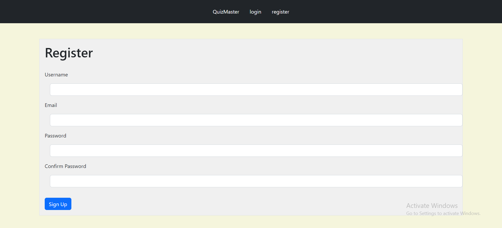
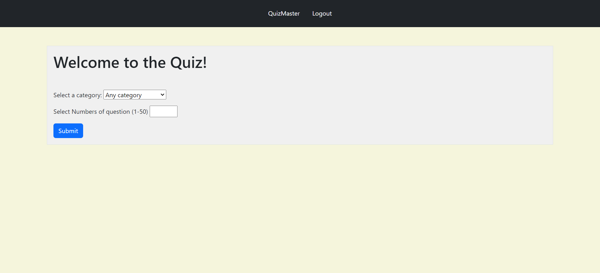
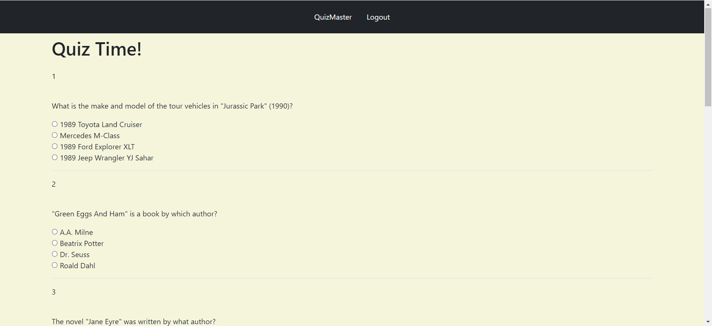

# Quiz_Master

## Introduction

    Welcome to Quiz Master - Your Ultimate Quiz Solution!

As an aspiring full-stack software engineer, I embarked on the journey of creating Quiz Master to combine my passion for coding with my love for learning and teaching. Inspired by the idea of making education enjoyable and accessible, I envisioned Quiz Master as a platform where users could engage in interactive quizzes across various categories, fostering a love for learning and knowledge exploration for users of all ages and backgrounds.

    
| Author(s) Name        | Role                  | Author(s)LinkedIn      |
|-----------------------|-----------------------|-----------------------|
| Ugwoke Levi Soromto   | Back-end Engineer     | [Profile](https://linkedin.com/)                |
| Abdussalam Adam Oladeji | DataBase Administrator | [Profile](https://www.linkedin.com/in/abdussalam-adam-752332289)                |
| Kumah Georgina Emefa  | Front-end Engineer    | [Profile](https://linkedin.com/)              |

**Final Project Blog Article:** [Building Quiz Master](https://www.linkedin.com/pulse/building-quiz-master-journey-learning-challenges-abdussalam-adam-ahrof)

## Installation

To install Quiz Master locally, follow these steps:

1. Clone the repository:
git clone https://github.com/Adams009/Master_Quiz.git

2. Navigate to the project directory:
cd Master_Quiz

3. Install dependencies:
pip install -r requirements.txt

4. Set up the database:
flask db init
flask db migrate
flask db upgrade

5. Run the application:
python run.py

## Usage

Once the application is running, visit http://localhost:5000 in your web browser to access Quiz Master. From there, you can register an account or login, browse categories, answer questions and track your progress.

## Contributing

We welcome contributions from the community! If you'd like to contribute to Quiz Master, please follow these guidelines:

1. Fork the repository.
2. Create a new branch for your feature or bug fix: `git checkout -b feature-name`.
3. Commit your changes: `git commit -m 'Add new feature'`.
4. Push to your fork: `git push origin feature-name`.
5. Submit a pull request with a detailed description of your changes.

## Related projects

## Licensing

**Screenshot:**

## Inspiration and Challenges

The inspiration for Quiz Master came from my desire to create a fun and interactive learning experience. However, the journey wasn't without its challenges. One of the most difficult technical challenges I faced was implementing secure user authentication and password hashing.

To overcome this challenge, I researched various authentication methods and best practices for securing user data. After careful consideration, I decided to use Flask-Login for managing user sessions and Werkzeug.security for hashing passwords. While this solution provided a solid foundation, I faced difficulties in integrating OAuth with Facebook and Gmail for seamless user authentication.

Looking ahead, I envision implementing OAuth with Facebook and Gmail to enhance the user experience and make registration/login more convenient. Additionally, I plan to optimize the application's performance and user interface to create a seamless and enjoyable experience for all users.